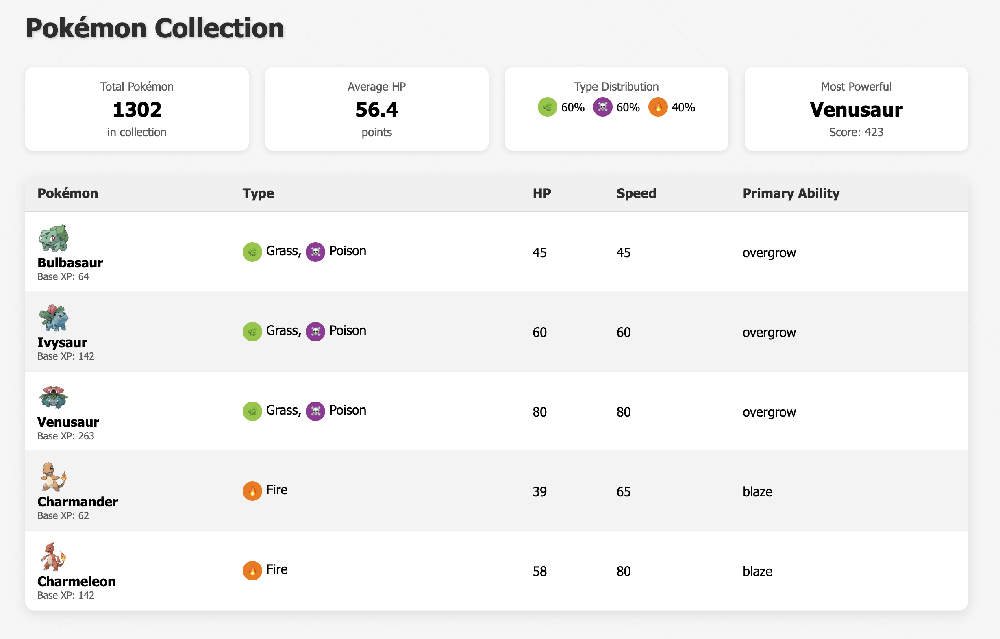
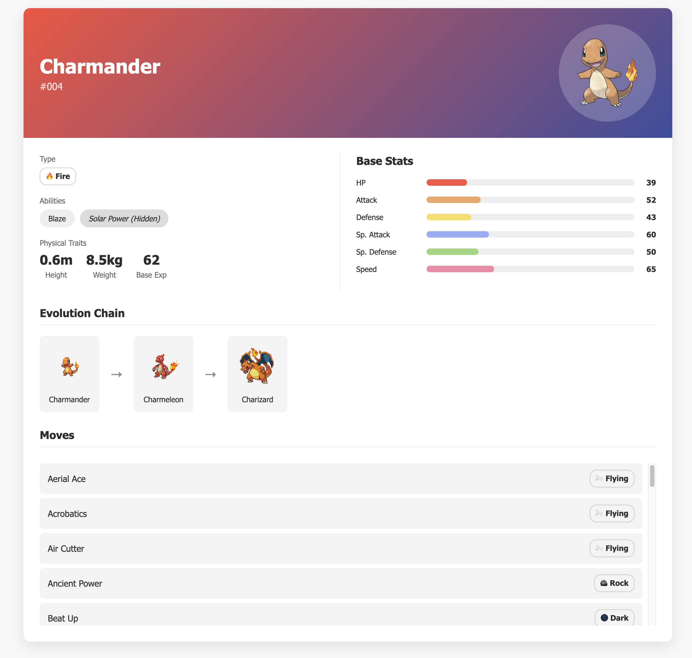

# 🐉 Pokémon Explorer Code Challenge

## Overview

Welcome! This challenge is designed to simulate one slice of Flywire’s day-to-day work: building a fast, accessible, and maintainable React SPA with a real-world public API. You’ll create a small "Pokémon Explorer" that lets users:

1. **Browse** a list of Pokémon in a table view.
2. **Inspect** details for any Pokémon by clicking its row.

Two wireframes (Table View & Details View) are provided in the `/wireframes` directory as a visual guideline—your implementation should follow their layout and flow but does **not** need to be pixel-perfect.

Behind the scenes you’ll fetch data from [PokeAPI](https://pokeapi.co/) and demonstrate best-in-class frontend practices.

---

## 🚀 Getting Started

1. **Clone** this repo and install dependencies:
   ```bash
   npm install
   ```
2. **Run** in development mode:
   ```bash
   npm start
   ```
3. **Run tests**:
   ```bash
   npm test
   ```
4. **Build** for production:
   ```bash
   npm run build
   ```

---

## 🎯 Mandatory Requirements

1. **Tech Stack**
   - **React** as the primary library (mandatory)
   - All other choices (TypeScript vs. JavaScript, styling tools, testing frameworks, state management etc.) are yours to decide. See the **Bonus Points** section for technologies that will earn extra credit.

2. **Table View**
   - Fetch Pokémon data from PokeAPI and display a paginated list. You can display for example 5 - 10 at a time per page or batch.
   - Columns:
     - Sprite image
     - Name + Base XP
     - Type(s) (icons or colored badges are optional but desirable)
     - HP stat
     - Speed stat
     - Primary ability
   - The stats header is optional

<div align="center">
  
</div>

1. **Details View**
   - On row click, show a detail panel or separate route.
   - Display:
     - Pokémon name, ID, Official artwork (from sprites.other['official-artwork'].front_default)
     - Type(s)
     - Base stats (HP, Atk, Def, Sp. Atk, Sp. Def, Speed)
     - Physical traits (height, weight, base XP)
     - Evolution chain (optional)
     - Scrollable list of moves with type labels
   - Implement "back" navigation.

<div align="center">
  
</div>

4. **Code Quality & Architecture**
   - Follow TDD if possible: tests first where practical.
   - Clean, modular, DRY code with clear separation of concerns.
   - Proper error handling and edge-case coverage.
   - Accessibility best practices are desirable.

---

## ✨ Bonus Points 💯

- The Stats header in the table view:
  - Show the total amount of pokémon in the collection
  - The average HP in the current view
  - The pokémon type percentages in the current view
  - The most powerful pokémon in the current view, this might be a combination of HP, Speed and base XP
- **Sorting** by any stat column in the table view
- Routing
- Typescript
- Tailwind CSS for styling
- Jest + React Testing Library for unit/integration tests
- Playwright for end-to-end tests
- Containerize with **Docker**.
- Responsive design (mobile ↔ desktop).

---

## 📤 Submission

1. Clone the template repo
   This challenge is hosted on a starter repository we've prepared for you. Start by cloning it.

2. Work on your solution
   Implement your code directly in this repo. Commit early and often — we’d love to see how you approach the problem.

3. (Optional) Document your decisions
   If you want to explain architectural decisions, trade-offs, or anything else about your approach, feel free to create a short section at the bottom of the README titled 🧠 Notes or 📌 Design Decisions.

4. Open a Pull Request
   When you're done, open a pull request against this repo. Please include a brief summary of what you built, and any notes we should be aware of during the review.

**Good luck!**

---

## 🧠 Project Documentation Notes

1. Initial project setup
   - installed Eslint for linting
   - installed Husky for pre-commit checks
   - installed Preetier for consistent formatting between all the devs.
   - Configured the Project using Vite
   - installed Jest and React Testing Library for Unit Testing.
   - installed Tailwind Css for styling
   - installed React Router DOM for SPA Routing
   - installed React Query

## 📌 Design Decisions Notes

1. Setting up @tanstack/react-query via QueryClientProvider
   - Reason : This app needs to fetch, cache, and manage Pokémon API data efficiently without manually handling loading, error, or refetch states | React Query for caching
   - Pros: Automatic caching & background refetching, Simplifies async state management.
2. Using BrowserRouter from react-router-dom
   - Reason: Enables client-side routing for navigation between the Pokémon list, details page, etc.
   - Pros:Declarative route definitions, Seamless navigation without full page reloads.
3. Importing index.css globally - Provides base Tailwind CSS styles and any global resets, Keeps styling consistent across the app.
4. App.tsx
   - The App.tsx file acts as the central routing configuration for the application, defining which component is rendered for each URL path.
   - Page Separation:
     - PokemonCollection – Displays the list of Pokémon.
     - PokemonDetail – Shows detailed Pokémon info.
     - NotFound – Fallback for unknown routes.
5. PokemonCollection Component - main dashboard to display a paginated collection of Pokémon
   - **Pagination** - Controlled with `page` state and derived `offset` to fetch limited Pokémon per request.
   - **React Query for Data Fetching**
     - `usePokemonList` hook returns both a paginated Pokémon list and detailed queries for each Pokémon.
     - This parallel fetching approach reduces the time to render the complete dataset and does caching.
   - Clear separation of concerns: statistics, table, and pagination controls.
6. PokemonTable Component -
   - Renders a table of Pokémon with their details such as type, HP, speed, and ability.
   - Clicking on a row navigates to that Pokémon's detail page.
7. PokemonDetail Component - Component that displays detailed information for a single Pokémon.
   - Fetches Pokémon details from the API.
   - Displays general information such as types, abilities, height, weight, and base experience.
   - Shows base stats in a horizontal bar format.
   - Displays the evolution chain if available.
   - Lists all moves for the Pokémon - lazy-loading (infinite scroll) functionality
8. Added Unit Testing for all the components (JEST + RTL)
